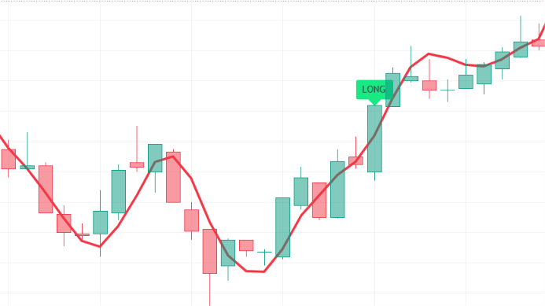

# Pine-Script-EMA-Cross-RSI-Hull-Indicator
Indicator based on 3-minute EMA 5 and EMA 36 crossover momentum, 1-minute RSI exhaustion filtering (< 70 / > 24), Hull Suite trend slope confirmation, and custom HMA overlay. Signals entry for Long and Short positions with visual labels on TradingView.

--

## Chart Preview

--

## Motivation & Problem
- **Chasing Exhausted Breakouts & Moving Average Lag**: Standard moving average crossover strategies frequently trigger right into overbought exhaustion tops or oversold bottoms, causing immediate drawdown before the trend continues.
- **The Core Goal**: To create a lean, responsive entry system that combines 3-minute fast EMA crossovers (EMA 5 vs. EMA 36) with 1-minute RSI boundary filters (preventing entries when RSI was already overbought > 70 or oversold < 24) and Hull Suite directional slope confirmation.

--

## Strategy Logic & Architecture
- This indicator avoids false signals and wrong interpretation of the trend by utilizing a **rule-based, multi-factor filtering system**:
### Core Components:
1. **3-Minute EMA Momentum Crossover (EMA 5 vs. EMA 36)**:
  - Computes a fast 5-period EMA and a 36-period baseline EMA on the 3-minute timeframe via 'request.security()'.
  - Detects early directional momentum shifts via 'ta.crossover()' and 'ta.crossunder()' events.
2. **1-Minute RSI Exhaustion Protection**:
  - Monitors 1-minute RSI (length 7) over the previous two bars ('RSI_3[1]' and 'RSI_3[2]').
  - **Bullish Safety**: Ensures RSI was strictly below 70 across prior bars to prevent buying into exhausted blow-off tops.
  - **Bearish Safety**: Ensures RSI was strictly above 24 across prior bars to prevent shorting into oversold capitulation bottoms.
3. **Hull Suite Trend Slope Confirmation**:
  - Evaluates the directional trajectory of the Hull Suite band ('HULL' vs. 'HULL[2]').
  - Enforces that long entries only fire during an upward-sloping Hull Suite ('HULL > HULL[2]') and short entries only fire during a downward-sloping Hull Suite ('HULL < HULL[2]').
4. **Fast HMA Plotting Overlay**:
  - Plots a standalone 9-period Hull Moving Average (linewidth 3, red) on the chart for immediate visual feedback on short-term price curvature.
5. **Execution Rules**:
  - **Bullish Signal (LONG)**: Triggers when:
    1. 3m EMA 5 crosses above 3m EMA 36 ('ta.crossover(ema5_3, ema30_3)').
    2. 1m RSI on the preceding two bars was below 70 ('RSI_3[1] < 70 and RSI_3[2] < 70').
    3. Hull Suite slope is trending upward ('HULL > HULL[2]').
    - Prints a green "LONG" label above the bar.
  - **Bearish Signal (SHORT)**: Triggers when:
    1. 3m EMA 5 crosses below 3m EMA 36 ('ta.crossunder(ema5_3, ema30_3)').
    2. 1m RSI on the preceding two bars was above 24 ('RSI_3[1] > 24 and RSI_3[2] > 24').
    3. Hull Suite slope is trending downward ('HULL < HULL[2]').
    - Prints a red "SHORT" label above the bar.
    
--

## Configurable Parameters
Users can adjust the following parameters inside TradingView's settings panel:
- **Fast EMA Length**: Default - 5. Lookback period for the fast momentum EMA on the 3m chart.
- **Baseline EMA Length**: Default - 36. Lookback period for the baseline trend EMA on the 3m chart.
- **RSI Length**: Default - 7. Lookback period for 1-minute RSI exhaustion filtering.
- **Hull Suite**: Default - Length 55, HTF 240m. Customizable visualization switches, band transparency, and line thickness.
- **HMA Overlay**: Default - Length 9. Standalone Hull Moving Average plot period.

--

## How to Install & Use in TradingView
1. Open any crypto chart (e.g., `BTC/USDT`) on **[TradingView](https://www.tradingview.com/)**.
2. Open the **`Pine Editor`** console at the bottom of the page.
3. Open `MyOwn.txt` (or your Pine Script file), copy the source code, and paste it into the editor.
4. Click **`Save`** and then click **`Add to Chart`**.
5. Set your chart timeframe to **`3m`** and click the gear icon (`Settings`) on the indicator to adjust parameters as needed.

--

## Key Learnings & Engineering Reflections
1. **Exhaustion Guarding via Historical Multi-Bar RSI Checks**
  - I learned that checking the previous two bars of RSI ('RSI_3[1]' and 'RSI_3[2]') against boundary limits (< 70 for longs, > 24 for shorts) effectively eliminates "buying the top" and "selling the bottom" on moving average crossovers.
2. **Asymmetric Period Pairing (EMA 5 vs. EMA 36)**
  - I learned that pairing a fast 5-period EMA with a custom 36-period baseline provides an optimal balance between responsiveness and noise reduction on 3-minute charts, capturing fresh impulses early while avoiding rapid whipsaws.
3. **Trend Filtering with Hull Suite Slope ('HULL > HULL[2]')**
  - I learned that comparing current Hull Suite values against historical offsets ('HULL[2]') serves as a low-lag directional gatekeeper, ensuring entries are never taken counter to the dominant higher-timeframe flow.
